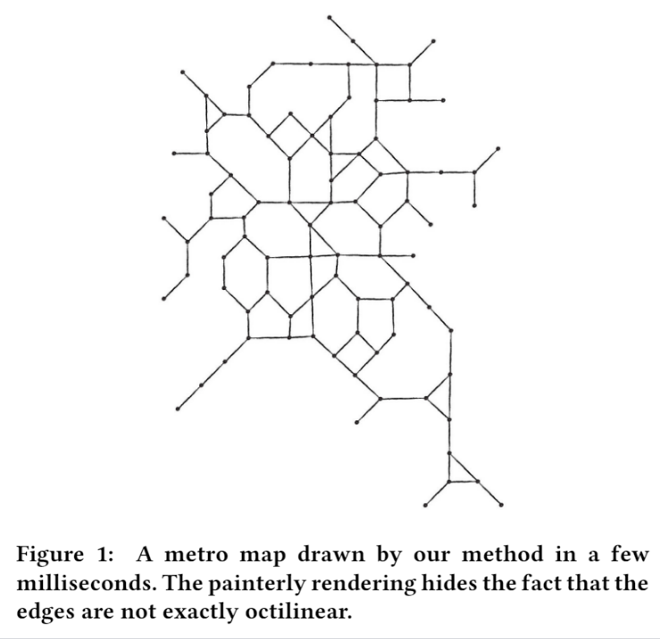

# Fast linear cartograms

Spatially-informative linear cartograms using least squares adjustment.

For details, see:

**Realtime linear cartograms and metro maps** [ [doi](https://doi.org/10.1145/3274895.3274959), [author's copy](https://github.com/tcvdijk/papers/blob/master/conference/sigspatial18_realtime_linear_cartograms.pdf) ] _Thomas C. van Dijk, Dieter Lutz (Lehrstuhl für Informatik I, Universität Würzburg)_- SIGSPATIAL '18: Proceedings of the 26th ACM SIGSPATIAL International Conference on Advances in Geographic Information Systems (November 2018) Pages 488–491

# Building

Run `make` in the src directory.

## Dependencies

Convenience copies of `eigen`, `pugixml` and `shapelib` are included in the repository.

The graphical user interface uses [FLTK](https://www.fltk.org/) and some algorithms use [CGAL](https://www.cgal.org/): your compiler needs to be able to find them. We recommend the `vcpkg` package manager.